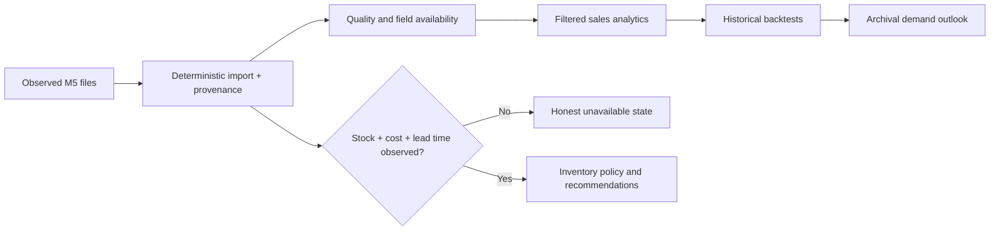

<div align="center">

# RetailMind AI

### Real retail sales. Auditable forecasts. Honest inventory boundaries.

An interactive Streamlit research platform for **AI-driven retail demand forecasting and sales analytics**.

[Quick start](#run-it) · [Real data](#the-data) · [What the app does](#product-workflow) · [Forecast study](docs/m5_validation.md) · [Deployment](docs/deployment.md)

</div>

---

## At a glance

| | Verified project state |
| --- | --- |
| **Input** | Observed M5 product/store/day sales, weekly selling prices, and calendar events |
| **Included dataset** | 109,650 rows · 150 product/store series · 147 products · 10 stores · 3 categories |
| **Observed period** | 23 May 2014–22 May 2016, inclusive |
| **Analytics** | Filtered demand, priced revenue, category/store views, seasonality, anomalies, data quality |
| **Forecasting** | Expanding-window backtests, model comparison, 7–30 day demand forecast, error band, export |
| **Persistence** | Optional SQLite or MySQL save/load; no database needed at startup |
| **Unavailable from M5** | Physical stock, unit cost, supplier and lead time; corresponding inventory/profit claims are disabled |

The application opens directly on **real observations**. It does not generate a demo dataset at startup. The source ends in 2016, so forecasts after that date are **archival experiments**, not current retail predictions.

The complete earlier prototype and its synthetic dataset remain in [`legacy/pre-real-data/`](legacy/pre-real-data/) and on the [preserved Git branch](https://github.com/9059Rohith/RetailMindAI/tree/archive/pre-real-data). They are kept for comparison and are not loaded by the current application.

## The data

The bundled [`m5_observed.csv.gz`](data/m5_observed.csv.gz) is a compact, reproducible subset of the public [M5 Forecasting Accuracy dataset](https://www.kaggle.com/competitions/m5-forecasting-accuracy/data). It was built from the official `sales_train_evaluation.csv`, `calendar.csv`, and `sell_prices.csv` files. The repository does not contain the large original source files.

Selection is deterministic and independent of observed demand: within every **store × category**, series are ranked by SHA-256 of `store|category|item` and the first five are selected. The last 731 observed days are retained. Daily unit sales are joined to the official calendar and weekly store/item price records. There is **no price, stock, cost, or demand imputation**. Full source checksums, exact sample checksum and method are recorded in [`data/m5_source.json`](data/m5_source.json); the transformation is in [`scripts/prepare_m5.py`](scripts/prepare_m5.py).

| Dataset fact | Observed result |
| --- | ---: |
| Daily rows | 109,650 |
| Sold units | 105,840 |
| Revenue from priced rows | $414,479.40 |
| Rows without an observed price | 863 |
| Duplicate product/store/date keys | 0 |
| Rows with zero sold units | 70,828 |

**Revenue is a partial observed total.** The 863 unpriced rows contribute their real units to demand analysis and no amount to revenue. They are never treated as a zero-dollar sale. Sales may be censored by stock availability, which M5 does not reveal. The official dataset is historical US retail research data, not a current business feed. See the [data dictionary](docs/data_dictionary.md) and [limitations](docs/limitations.md).

To regenerate this exact subset after obtaining the three official files:

```bash
python -m scripts.prepare_m5 --source path/to/m5-csv-directory --output data/m5_observed.csv.gz
```

## Product workflow



| Workspace | What it provides |
| --- | --- |
| **Overview** | Observed revenue and units, equal-window demand change, 90-day trend, archival seasonal baseline, category contribution and a short decision brief |
| **Data studio** | Source profile, key quality checks, missing-field inventory, reversible invalid-row quarantine, official M5 import and optional database actions |
| **Sales analytics** | Product/category/store/region breakdowns, weekday and holiday patterns, anomalies, descriptive price association; all linked to the global filters |
| **Forecast lab** | Product/store selection, horizon, expanding-window model comparison, WAPE/MAE/RMSE/bias, future path, empirical error band, residuals, model notes and CSV export |
| **Inventory** | A clear field-availability explanation for M5; observed stock and supply fields are needed before an order can be recommended |
| **Insights and reports** | Evidence-labeled demand signals, exports of observed records, KPIs, alerts and model results |

The interface has a dark, responsive design system, interactive Plotly charts, focused navigation, contextual empty states and reduced-motion support. Filters only expose dimensions present in the selected data.

## Forecasting method

The forecasting pipeline compares naive, seven-day seasonal naive, moving average, exponential smoothing, random forest and gradient boosting. ARIMA and weekly SARIMA are optional because they are more expensive to fit. Model selection uses **expanding-window, held-out dates**. Demand lags and rolling features exclude the target day. Recursive predictions do not use unknown future sales, prices, inventory or promotions.

The forecast band is derived from held-out residuals and is labeled as an empirical sensitivity estimate; it is **not** a guaranteed coverage interval. Historical accuracy varies materially by series. In a separate all-series M5 study, the 28-day moving average reached **73.86% aggregate WAPE** across 30,490 series, versus **86.22%** for seasonal naive. On nine selected series, app model selection beat seasonal naive on **3 of 9** untouched holdouts. These are measured research results, not a leaderboard score or claim of commercial performance. Read the [protocol and results](docs/m5_validation.md).

Run a reproducible observed-data backtest locally:

```bash
python -m scripts.evaluate --horizon 14
```

The command writes fold metrics to `artifacts/model_comparison.csv`. Select another observed product with `--product ITEM_ID`.

## Run it

Requires **Python 3.12+**.

```bash
git clone https://github.com/9059Rohith/RetailMindAI.git
cd RetailMindAI
python -m venv .venv
# Windows: .venv\Scripts\activate
# macOS/Linux: source .venv/bin/activate
python -m pip install -r requirements.txt
streamlit run app/main.py
```

Open `http://localhost:8501`. No API key, database or source download is needed for the bundled observed subset.

Docker starts Streamlit and MySQL:

```bash
docker compose up --build
```

If 8501 is occupied, set `APP_PORT=8502` before starting Compose. Optional MySQL data is local to the Docker volume. A Community Cloud deployment uses the bundled file directly and does not require MySQL.

## Verify the project

```bash
python -m pip install -r requirements-dev.txt
python -m ruff check .
python -m pytest -q
python -m scripts.evaluate --horizon 7
python -m compileall -q app retailmind scripts
```

The tests cover data ingestion, quality and cleaning, analytics, forecasting, inventory formulas, persistence, and Streamlit page rendering. The included sample is checked for its observed dimensions and missing fields. Synthetic records inside isolated **test fixtures** exercise edge cases; no test fixture is loaded by the application.

## Deploy on Streamlit Community Cloud

The code is in [GitHub](https://github.com/9059Rohith/RetailMindAI) on `main`. In Community Cloud choose the repository, branch **`main`**, and entrypoint **`app/main.py`**. Dependencies are in root `requirements.txt`; the real bundled data ships with the repo. No secrets are needed to start the public app.

The message **“app’s code is not connected to a remote GitHub repository”** can persist even after `git push` when the Community Cloud account has not authorized GitHub repository access. The repository owner must [connect their GitHub account to Community Cloud](https://docs.streamlit.io/deploy/streamlit-community-cloud/get-started/connect-your-github-account) and have admin access to the repository. This account authorization is separate from the local Git remote. Detailed instructions are in the [deployment guide](docs/deployment.md). A public `streamlit.app` URL should be shared only after an actual successful deployment.

## Academic scope and responsible interpretation

RetailMind demonstrates a complete, reproducible path from external source files through SQL-ready normalized storage, data quality, visual analysis, leakage-aware ML evaluation, forecast inspection and evidence export. Its inventory calculations remain available in code for datasets with real stock and supply records, but the M5 interface will not present ungrounded reorder amounts or profit.

The source is historical, price coverage is incomplete, and sales are an imperfect proxy for true demand when stock is unknown. Holiday comparisons and price correlations are descriptive. The system does not claim causal promotion uplift, measured ROI, current retail operations, or a novel forecasting algorithm. Those limits are part of the project’s research integrity.

**Project layout:** `app/` Streamlit UI; `retailmind/` testable analytics, models and persistence; `data/` observed subset and provenance; `scripts/` reproducibility; `notebooks/` research walkthroughs; `sql/` normalized MySQL schema; `docs/` methodology and external validation; `tests/` verification.

---

Source attribution: [M5 Forecasting Accuracy competition data](https://www.kaggle.com/competitions/m5-forecasting-accuracy/data) and [archived dataset record](https://zenodo.org/records/10203108). See the source host for dataset terms.
