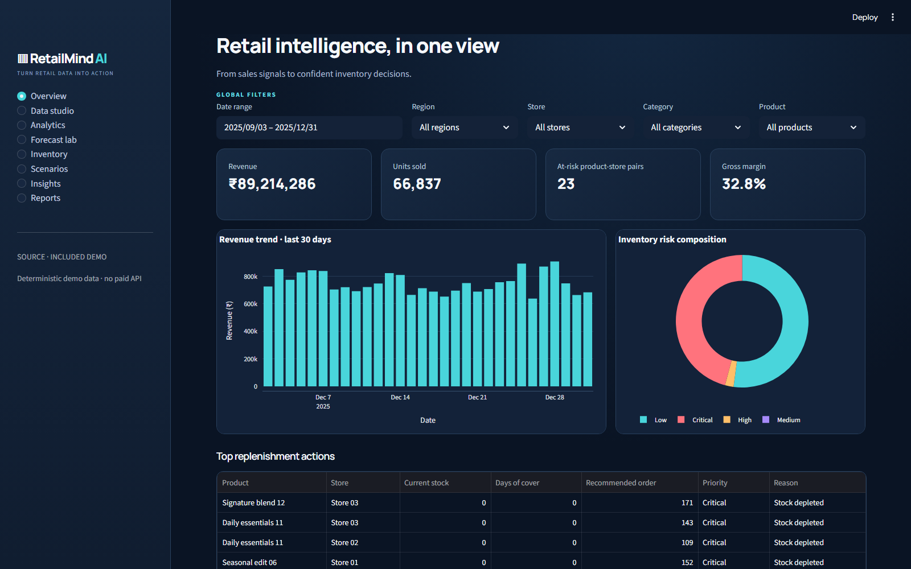

<div align="center">

# RetailMind AI

### From historical sales to future demand, inventory risk, and actionable decisions.

**AI-Driven Retail Demand Forecasting & Inventory Analytics**

[Run locally](#quick-start) · [Explore the workflow](#the-decision-chain) · [Read the methodology](docs/methodology.md) · [Deploy](docs/deployment.md)

</div>

---

Retail teams rarely struggle with a lack of charts. They struggle to connect a sales change to a credible demand forecast, a stock risk, and a concrete replenishment action. **RetailMind AI connects that chain in one runnable, research-conscious application.** It starts with an included dataset, needs no paid API, and makes its assumptions visible.

> **Status:** Functional Streamlit application and reproducible synthetic-data demo. Public hosting requires the repository owner to sign in to Streamlit Community Cloud. The bundled data are synthetic; the app does not claim real-world ROI or calibrated predictive coverage.

## The decision chain


| Question | Workspace | Concrete output |
| --- | --- | --- |
| What happened? | Overview, Analytics | Revenue, units, profit, trends, category/store/product breakdowns |
| Can we trust the data? | Data studio | Health score, issue list, explicit cleaning log, restore original |
| What may happen? | Forecast lab | Expanding-window backtests, model comparison, future demand |
| How uncertain is that? | Forecast lab | Backtest errors and a clearly labeled heuristic range |
| What could go wrong? | Inventory | Days of cover, stockout trajectory, risk and ABC × XYZ |
| What should we do? | Inventory | Safety stock, reorder point, EOQ, suggested orders |
| What if assumptions change? | Scenarios | Discount/promotion/lead-time/order sensitivity |
| Who receives scarce stock? | Inventory allocation | Priority-weighted constrained allocation |
| How do we explain it? | Insights, Reports | Rule-backed reasons and downloadable evidence |

## Product tour

The interface uses a midnight analytics theme with a consistent global filter bar. The opening dashboard shows current KPIs, the revenue trend, risk composition, and ranked replenishment actions. The workspace then follows the decision chain above. All primary calculations live in testable Python modules outside the UI.

<!-- The screenshot below is captured from the running application, not a design mockup. -->


## Quick start

Requires **Python 3.12+**.

```bash
git clone https://github.com/9059Rohith/RetailMindAI.git
cd RetailMindAI
python -m venv .venv
# Windows: .venv\Scripts\activate
# macOS/Linux: source .venv/bin/activate
python -m pip install -r requirements.txt
streamlit run app/main.py
```

Open `http://localhost:8501`. The committed demo loads immediately; no sign-in, API key, database or download is needed.

### Docker

```bash
docker compose up --build
```

This starts the app and a local MySQL container. Open `http://localhost:8501`. The sample credentials in `docker-compose.yml` are for local development only. SQLite fallback is available if MySQL cannot be reached.

## Data: bring your own or reproduce ours

The committed demo has **12 products × 4 stores × 120 days = 5,760 product/store/day observations**, generated with seed 42. It includes categories, regions, price, discounts, promotions, holidays, stock, lead times, suppliers, returns, revenue and gross profit. The **Data studio** can generate a larger 50+ product / 10+ store dataset on demand.

```bash
python -m scripts.generate_demo
```

Custom CSVs need `date`, `product_id`, `store_id`, `units`, `price`, `stock`. Optional columns are documented in the [data dictionary](docs/data_dictionary.md). The health engine reports missing cells, duplicate entity/date keys, invalid dates, negative sales or stock, missing IDs and extreme unit outliers. Cleaning is a deliberate button action; the original remains restorable in the session.

## Forecasting that respects time

RetailMind compares naive, seasonal naive, moving average, exponential smoothing, random forest and histogram gradient boosting when sufficient history exists. ARIMA and weekly SARIMA can be included from the Forecast lab; they are optional because fitting them across folds takes longer. It evaluates with **expanding-window folds**, never a random train/test split. Demand lags and rolling statistics are shifted to exclude the target day. Recursive ML predictions use only already observed or previously predicted values. Future price, promotion and inventory are left out of the standard forecast because they are unknown without a scenario. The explanation panel shows the selection rule and, for ML winners, training-data permutation importance with its limits.

| Metric | Meaning | Caution |
| --- | --- | --- |
| MAE / RMSE | Typical absolute / squared error scale | RMSE emphasizes large misses |
| WAPE | Total absolute error ÷ total actual units | Undefined if actual demand is all zero |
| MAPE / sMAPE | Percentage error views | MAPE excludes zero-actual days here |
| MASE | Error against seasonal naive scale | Undefined when scale is zero |
| Bias | Mean prediction minus actual | Positive means overforecast |
| Under / overforecast | Directional missed units | Useful for inventory consequences |

Run an actual experiment and inspect the generated CSV:

```bash
python -m scripts.evaluate --product P001 --horizon 14
```

For the committed synthetic demo, `python -m scripts.evaluate --product P001 --horizon 7` produced these **mean held-out fold** results on the local verification run (seed 42; three expanding-window folds):

| Model | WAPE | MAE (units/day) | Bias (units/day) |
| --- | ---: | ---: | ---: |
| Random forest | 16.74% | 7.35 | +3.88 |
| Exponential smoothing | 16.95% | 7.58 | +1.18 |
| Moving average | 17.13% | 7.69 | +3.00 |
| Gradient boosting | 19.69% | 8.59 | +5.07 |
| Naive | 20.11% | 9.52 | −6.00 |
| Seasonal naive | 21.45% | 9.43 | +2.95 |

These are results on generated data for one product and horizon, not a general accuracy claim. The CSV saved in `artifacts/` has the individual fold metrics and can be regenerated with the command above.

The forecast band is **heuristic**, based on observed backtest MAE. It is shown as a sensitivity cue, not a calibrated 90% prediction interval. See [forecasting methodology](docs/forecasting.md).

## Inventory decisions with visible assumptions

- **Safety stock:** service-level z-score × observed daily standard deviation × √lead time.
- **Reorder point:** mean lead-time demand + safety stock.
- **EOQ:** the classical order/holding-cost formula, with its assumptions stated in the UI and [inventory notes](docs/inventory.md).
- **ABC × XYZ:** revenue contribution crossed with demand coefficient of variation.
- **Risk:** an explainable rule score based on stock, lead-time shortfall, reorder point, cover and stockout history; it is not a probability.
- **Allocation:** linear optimization of priority-weighted fulfilled demand under a shared stock cap.

The what-if model assumes price elasticity **−1.1** and promotion uplift **+15%**. Those values can illustrate a decision but cannot establish causal uplift or ROI. Revenue and gross profit are calculated on **fulfilled units**, so a stock-constrained scenario does not count imaginary sales.

## Architecture and repository map

```text
app/                 Streamlit pages and visual system
retailmind/          Data, analytics, forecast, inventory, insights, database
data/                Included deterministic demo CSV
scripts/             Reproducible generator and evaluation commands
notebooks/           Six focused research notebooks built from shared modules
sql/                 Normalized MySQL academic schema
tests/               Behavior and leakage tests
docs/                Architecture, methods, formulas, deployment, limits
ci/                  GitHub Actions workflow template
```

The [architecture document](docs/architecture.md) traces ingestion through decision support. MySQL is optional for the local/academic setup; SQLite is the default fallback. The included demo does not write to a database until the user explicitly saves it. The public Streamlit process is not a confidential-data store.

## Quality gates

```bash
python -m pip install -r requirements-dev.txt
python -m ruff check .
python -m pytest -q
python -m scripts.generate_demo
python -m scripts.evaluate
python -m compileall -q app retailmind
```

The workflow template at [`ci/quality-gates.yml`](ci/quality-gates.yml) is ready to copy to `.github/workflows/ci.yml`. The current GitHub credential cannot write workflow files, so hosted CI is **not yet active**. Local checks run as shown above. Tests check deterministic generation, cleaning without source mutation, KPI formulas, lag leakage, rolling backtests, inventory formulas, risk, scenarios and allocation.

Six notebooks cover data understanding, EDA, leakage-safe features, forecasting, inventory and model comparison. Regenerate them with `python -m scripts.create_notebooks`; they call the same tested application functions rather than duplicate a second modeling pipeline.

## Deployment

The app is prepared for **Streamlit Community Cloud** using `app/main.py` on the `main` branch. It uses only the committed demo CSV and open-source packages at startup; no paid service or secret is required. The repository owner must connect their GitHub account to Community Cloud and create the app there; a live URL is not claimed until that step succeeds. Follow the [deployment guide](docs/deployment.md) for the exact app settings and operational limitations.

## Academic contribution and limits

The contribution is the **integration of data quality, time-aware prediction, inventory policy, simulation and allocation** in a single reproducible decision workflow. This repository does not claim a novel forecasting algorithm or a measured commercial outcome. The data are synthetic, price/promotion analyses are observational, the interval is uncalibrated, and the risk score is a policy heuristic. See [limitations and future experiments](docs/limitations.md) and the [research methodology](docs/methodology.md).

For an academic presentation: demonstrate **Data studio → Analytics → Forecast lab → Inventory → Scenarios → Insights**. That tells a coherent story from evidence to action without treating simulation as fact.

## Acknowledgements and license

The project is informed by standard time-series validation and classical inventory formulas. The synthetic dataset, implementation and documentation in this repository are original. Dataset fields are designed to resemble common retail forecasting benchmarks; no M5 competition data are redistributed here.

Released under the [MIT License](LICENSE). If you use this project in research, cite the repository URL and a specific commit SHA so the implementation can be reproduced.
