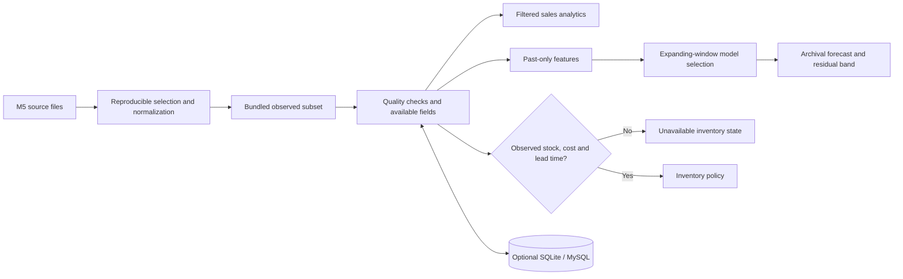

# Architecture

`app/` holds the Streamlit interface and cache boundaries; `retailmind/` holds testable data, analytics, forecasting, inventory and SQL code. Startup reads the compact committed file and requires no database. An explicit Data studio action can write to SQLite or MySQL. SQLite stores snapshots; MySQL stores normalized dimensions/facts plus a snapshot for round trips. The SQL schema and analytical queries live under `sql/`.

Streamlit Community Cloud has an ephemeral local filesystem. Local model registry entries and database snapshots are not durable shared storage on that host. Public deployment should not be used for confidential uploads without authentication, tenant isolation and durable storage.
