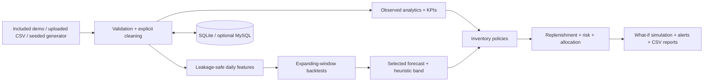

# Architecture

RetailMind AI separates **observed data**, **prediction**, and **decision support**.

The Streamlit interface is in `app/`. Testable calculations are in `retailmind/`. The included CSV is small enough for Community Cloud. Uploaded data remains in the user's Streamlit session unless they press **Save current dataset to database**. In a public deployment, local SQLite storage is ephemeral and shared by the app process; do not upload confidential data.

The MySQL DDL in `sql/mysql_schema.sql` documents a normalized academic schema (`products`, `stores`, `sales`, `inventory`, `forecast_runs`). The application's quick-save path persists a separate denormalized `sales_snapshot` table via pandas SQL for easy demo round trips, leaving the normalized tables intact. For a production multiuser deployment, use migrations, separate tenant identity and write access controls.
