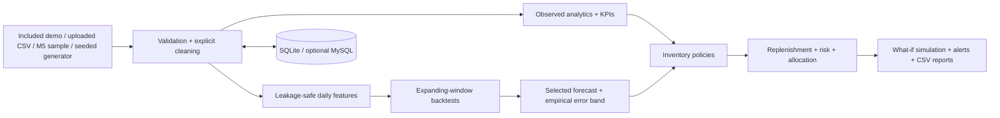

# Architecture

RetailMind AI separates **observed data**, **prediction**, and **decision support**.

The Streamlit interface is in `app/`. Testable calculations are in `retailmind/`. The included CSV is small enough for Community Cloud. Uploaded data remains in the user's Streamlit session unless they press **Save current dataset to database**. In a public deployment, local SQLite storage is ephemeral and shared by the app process; do not upload confidential data.

The MySQL DDL in `sql/schema.sql` defines dimensions, sales and inventory facts, forecast runs, metrics, recommendations, alerts and quality runs. `sql/indexes.sql`, `sql/seed.sql` and `sql/analytical_queries.sql` provide indexing, reference data and repeatable analytical queries. A MySQL save populates the normalized retail dimensions and facts plus a denormalized `sales_snapshot` for demo round trips. SQLite stores only the snapshot. For a production multiuser deployment, add migrations, tenant identity, authorization and durable model storage.
